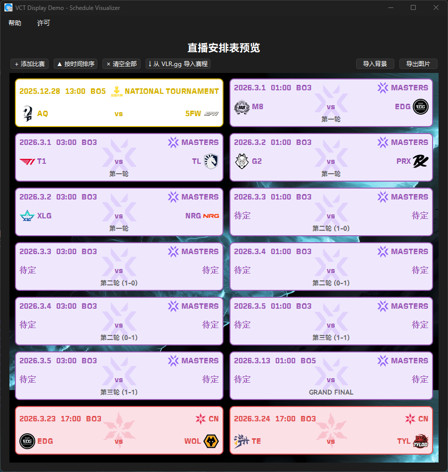

# VCT Display Demo - Valorant 赛事日程生成器

一个用于生成 Valorant Champions Tour (VCT) 赛事日程图的桌面应用程序。支持手动编辑和从 VLR.gg 自动导入赛程，可导出为高清竖向长图。



## 主要功能

### 1. 赛程管理
- **可视化卡片**：直观展示比赛时间、对阵双方、赛事类型、赛制（BO1/BO3/BO5）。
- **增删改查**：轻松添加、编辑、删除和排序比赛卡片。
- **智能排序**：支持按比赛时间自动重新排序。
- **快捷键支持**：
  - `Ctrl+C`：复制选中比赛信息
  - `Ctrl+V`：粘贴比赛信息
  - `Delete`：删除选中比赛
- **数据持久化**：自动保存赛程数据到本地 `matches.json`，下次打开自动加载。

### 2. 自动化导入
- **VLR.gg 集成**：内置 API 接口，一键导入 VLR.gg 赛程数据。
- **智能解析**：
  - 自动识别赛事类型 (Masters, Champions, Pacific, EMEA, Americas, CN, etc.)
  - 自动转换时区和时间格式（向最近半点取整）
  - 智能匹配队伍名称和图标 (例如 "EDward Gaming" -> "EDG")
  - 支持按赛事筛选和多选导入

### 3. 图片导出
- **自定义背景**：支持导入自定义背景图片，自动适配宽度。
- **多倍率高清导出**：
  - 支持 960px / 1080px / 1920px / 2880px 等多种宽度的竖向长图。
  - 自动计算高度，支持背景图片平铺或裁断。
  - 高质量渲染字体和图标。

### 4. 丰富的资源库与队伍选择
- **队伍图标**：内置四大赛区 (Pacific, EMEA, Americas, CN) 及次级联赛队伍图标。
- **智能筛选**：
  - 选定特定赛区 (如 VCT CN) 后，队伍列表会自动锁定对应赛区。
  - 支持在 "Others" 分区手动输入未收录的队伍名称（如 TBD/待定）。
- **赛事标识**：支持各种级别的赛事 Logo 显示。

### 5. 其他功能
- **菜单栏**：提供详细的 "帮助" 和 "许可" 信息查看。
- **关于与许可**：遵循 MIT 开源协议，内含详细版权声明。

## 使用说明

### 运行程序
1.  确保已安装 Python 3.10+。
2.  安装依赖库：
    ```bash
    pip install -r requirements.txt
    ```
3.  运行主程序：
    ```bash
    python main.py
    ```

### 编译为 EXE
双击运行根目录下的 `build.bat` 脚本，即可自动打包为单文件可执行程序 `dist/VCT_Display.exe`。
> 注意：首次编译可能需要较长时间下载 PyInstaller。

## 文件结构

- `main.py`: 程序入口，包含菜单栏与主窗口逻辑
- `preview.py`: 核心预览界面，负责卡片布局与导出功能
- `dialogs.py`: 比赛编辑、导入与导出设置对话框
- `cards.py`: 比赛卡片 UI 组件，支持高分屏渲染
- `api_import.py`: VLR.gg API 数据获取与解析线程
- `widgets.py`: 自定义控件 (如队伍选择器 TeamPickerWidget)
- `utils.py`: 通用工具函数 (路径处理、名称标准化)
- `config.py`: 全局配置、常量与队伍映射表
- `assets/`: 字体、图标与图片资源

## 技术栈

- **GUI Framework**: PyQt6
- **Image Processing**: Pillow (PIL)
- **Data Source**: VLR.gg API (Unofficial via scraping)
- **Build Tool**: PyInstaller

## 贡献与反馈

欢迎提交 Issue 或 Pull Request 来完善队伍图标库或映射规则。

---
*Disclaimer: This project is not affiliated with Riot Games or VLR.gg.*
